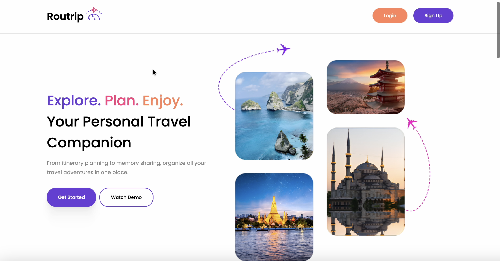
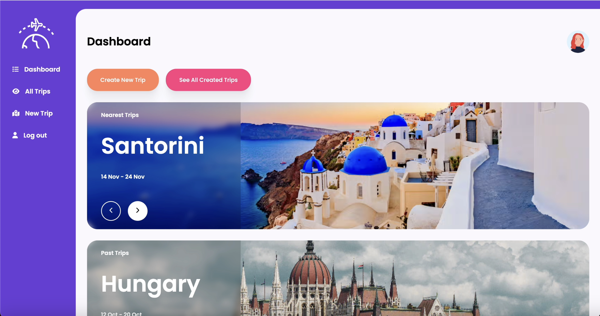
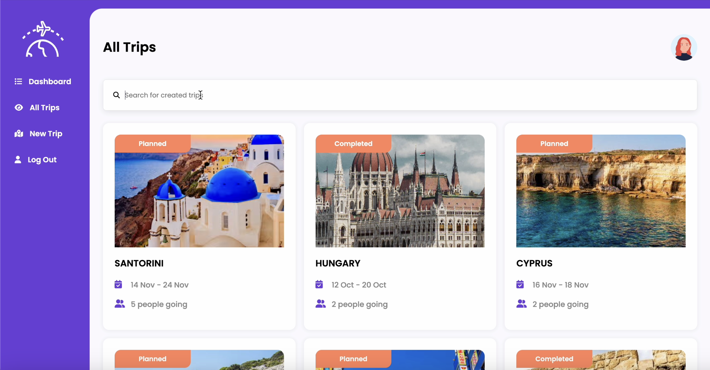

# Routrip

## ✈️ Routrip is a web application for trip planning.

It allows users to organize their travels, manage destinations, and customize itineraries easily and efficiently.

This project is built with Angular, uses Firebase for backend services (authentication, database, storage), and is styled with SCSS for modular and maintainable styles.

This project was generated with Angular CLI version 15.2.6.

🚀 How to Run the Project

## Clone the repository
`git clone https://github.com/kiowoji/routrip.git`
## Navigate into the project folder
`cd routrip`
## Install dependencies
`npm install`
## Run the development server
`ng serve`
## Open in browser
Go to http://localhost:4200/ — the app will automatically reload when you change any source files.
